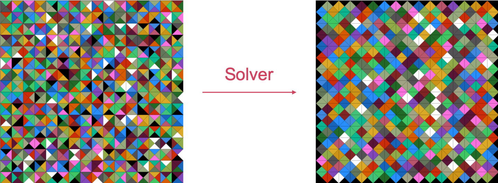

# EternityII
<div align="center">

</div>

<br>

This is the solver of pseudo EternityII. The comments in the codes are written in Japanese.

# Description
In this system, we considered EternityII as more simple one, and call it "Pseudo EternityII". Originally, EternityII is a puzzle competition which was released on 28 July 2007. Tow million dollars are put on the puzzle, but noone can solve the puzzle. EternityII puzzle is an "edge-matching puzzle" which includes 256 square puzzle pieces and place them into a 16 by 16 grid. Then players must match adjacent edges. This puzzle is too difficult and time consuming to solve with laptop. Therefore, I introduced the easier version named Pseudo EternityII. The requirements of Pseudo EternityII are listed below.

<br>

- The grid size is controllable.
- The kind of inner color are controllable.
- The pieces cannot be rotated.
- The middle piece is placed from the brginning.

<br>

In addidion, to make the puzzle simpler, the grid size is set as odd number. This is becuase if the grid size is odd number, the middle piece is defined uniquely.

<br>

The main contents are divided into two types. 

<br>

1. Drawing EternityII: 
2. Solving EternityII: 

<br>

To our knowledge, we have tried to visualize EternityII for the first time. Drawing EternityII, we can tackle the puzzle from visualizetion and catch the missed pieces qualitatively.

<br>

# Usage
## Drawing
```
$ python drqing.py [the number of the girds side] [the number of colors]
```

<br>

Arguments:  
1. The number of grids side. If you choose 3, 9 pieces are created.
2. The number of colors you can use to the puzzle.

<br>

Return:
- An answer of the puzzle (answer.png)
- A shuffled puzzle (input.png)

<br>

Note:
- If you choose too many colors, the message like "Please set the differnt number of color. Anyway, we'll make the puzzle using hogehoge colors." is appeared.

<br>

## Solving
```
$ python solver.py [the number of the girds side] [the number of colors]
```

<br>

Arguments:  
1. The number of grids side. If you choose 3, 9 pieces are created.
2. The number of colors you can use to the puzzle.

<br>

Return:
- A solved pieces of the puzzle throgh the solver (output.png)

<br>

Standard Output:
- Accuracy rate of the edges. 

<br>

Note:
- If you choose too many colors, the message like "Please set the differnt number of color. Anyway, we'll make the puzzle using hogehoge colors." is appeared.
- This solver does not do backprop. Therefore, in some cases, the accuracy rate cannot reach 100%.
